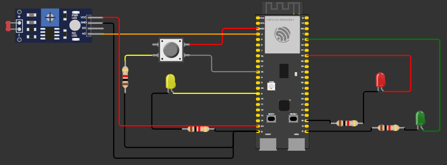

# Prova Módulo 4

&emsp;A seguir, há uma imagem que ilustra as conexões feitas para cumprir com os requisitos impostos. 

&emsp;No código, foi criada a variável que "ligarVerde" que controla a função de ligar o led verde um segundo após o botão ser pressionado caso isso ocorra enquanto o vermelho estiver ativo.

&emsp;Infelizmente, não será possível comprovar o funcionamento da solução desenvolvida devido à instabilidade da plataforma Wokwi. Nas primeiras tentativas, não estava conseguindo conectar ao Wi-Fi; após algum tempo, não pude mais compilar o código, como mostrado abaixo:

